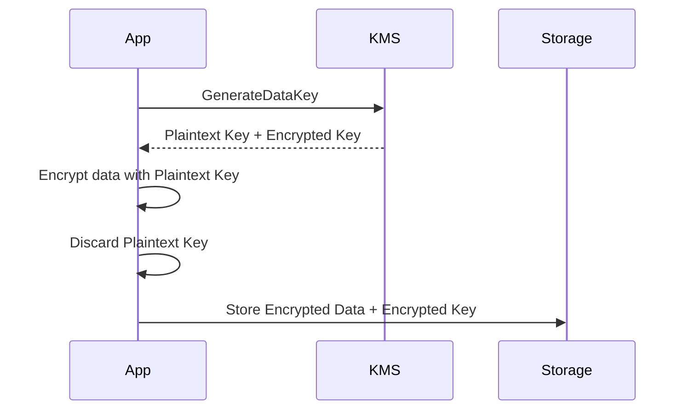

Security Fundamentals in AWS

<!--more-->

## 🔐Encryption

Encryption is a critical component of a defense-in-depth strategy, which is a security approach adopted by AWS with a series of defensive mechanisms designed so that if one security mechanism fails, there’s at least one more still operating.

There are 2 forms of encryption in practice:

###### Encryption in transit🚙:

* Data is encrypted before sending and decrypted after receiving
* SSL certificates help with encryption (HTTPS)
* Encryption in flight ensures no MITM (man in the middle attack) can happen


###### Encryption at Rest💤:

* Data is encrypted after being received by the server
* Data is decrypted before being sent
* It is stored in an encrypted form thanks to a key (usually a data key)
* The encryption / decryption keys must be managed somewhere and the server must have access to it.
*  There are two main methods to encrypt data at rest:

   * **Client-Side** Encryption: As the name implies this method encrypts your data at the client-side before it reaches backend servers or services. You have to supply encryption keys 🔑 to encrypt the data from the client-side. You can either manage these encryption keys by yourself or use AWS KMS(Key Management Service) to manage the encryption keys under your control.

     AWS provides multiple client-side SDKs to make this process easy for you. E.g. AWS Encryption SDK, S3 Encryption Client, DynamoDB Encryption Client etc…

     

   * **Server-Side** Encryption: In Server-Side encryption, AWS encrypts the data on your behalf as soon as it is received by an AWS Service. Most of the AWS services support server-side encryption. E.g. S3, EBS, RDS, DynamoDB, Kinesis, etc…

     All these services are integrated with AWS KMS in order to encrypt the data.

     

## 🗝️KMS

AWS Key Management Store (```KMS```) is a managed service that enables you to easily **encrypt** your data.
AWS KMS provides a highly available key storage, management, and auditing solution for you to encrypt data within your own applications and control the encryption of stored data across AWS services.

KMS is used to fully manage the keys & their policies:
* 🆕Create
* 🔄Rotation policies
* ⏸️Disable
* ▶️Enable
* 🔎Able to audit key usage (using CloudTrail)
* 💶Pay for API call to KMS ($0.03 / 10000 calls)

###### KMS Key Types

```markmap {height="300px"}
- 🔐**KMS Keys**
  - 🔧**Customer Managed Keys**
      Full lifecycle control  
      Custom key policies  
      $1/month + usage
    - 🔁**Symmetric Keys**
        AES-256  
        Used for ```Encrypt/Decrypt```  
        - 📨**Data Keys**
             Ephemeral symmetric keys  
             Used for local encryption of large data (Envelope Encryption)
        - 📥**Imported Key Material**
             Bring your own key (```BYOK```)
        - 🏦**External Key Store (```XKS```)**
             Key lives outside AWS  
             AWS KMS acts as proxy  
    - 🔀**Asymmetric Keys**
         RSA or ECC key pairs  
         Used for ```Encrypt/Decrypt``` or ```Sign/Verify```
    - 🌍**Multi-Region Capability**
         Available for both Symmetric and Asymmetric keys  
         Enables **cross-region** encryption/decryption  
         Same key material, separate resource IDs
  - 🛠️**AWS Managed Keys**
       Created and managed by AWS  
       Always 🔁**Symmetric Keys**  
       View Key Policy(ReadOnly) and audit in CloudTrail
       Free
  - 🏢**AWS Owned Keys**
       Internal to AWS  
       Used for **default** encryption  
       Always 🔁**Symmetric Keys**  
       No access to find/editds Key Policy
       Free
```

###### Customer Managed Key (CMK) Types

* 🔁**Symmetric** (```AES-256``` keys)

  * Single encryption key that is used to ```Encrypt``` and ```Decrypt```
  * AWS services that are integrated with KMS use ```Symmetric``` CMKs
  * Necessary for ```Envelope``` encryption
  * You never get access to the unencrypted Key (must call KMS APIs to use)
  * KMS can only help in encrypting up to **4KB** of data per call. If data > 4 KB, then use ```Data Keys```.
  * To give access to KMS to someone:
    * Make sure the Key Policy allows the user
    * Make sure the IAM Policy allows the API calls


* 🔀**Asymmetric** (```RSA``` & ```ECC``` key pairs)

  * Public (```Encrypt```) and Private Key (```Decrypt```) pair
  * Used for ```Encrypt/Decrypt```, or ```Sign/Verify``` operations
  * ```Public``` key is **downloadable**; ```Private``` key remains **protected**.
  * Anything encrypted with a ```public``` key can only be decrypted by the corresponding ```private``` key.
  * 🧠Use cases: 
    * Encryption outside of AWS by users who can’t call the KMS API
    * Public distribution of software packages (say ```Docker```) where end users needs to verify the authenticity.

{}

Key Considerations:

1. A key drawback to ```asymmetric``` cryptography is the fact that you cannot encrypt large pieces of data. When you have a 2048-bit RSA key pair and encrypt something by using the cipher RSAES_OASEP_SHA_256, the largest amount of data that you can encrypt is **190** bytes.

2. In contrast, ```symmetric``` encryption ciphers that use a chained or counter-mode operation don’t have this limit, and they make it possible for you to encrypt data in the tens-of-gigabytes.

3. KMS keys (symmetric or asymmetric) encryption limit: **4KB** (4096 bytes) per Encrypt API call - this is a ```KMS``` service-imposed limit, not a ```cryptographic``` one. 

4. So typically the client would use a [hybrid cryptosystem](https://en.wikipedia.org/wiki/Hybrid_cryptosystem) i.e. the client encrypts its large payload by using a symmetric key, then encrypts that symmetric key by using the downloaded RSA public key. End clients then transmit only encrypted **data** and encrypted **key** across insecure channels, maintaining privacy of the payload data.

{}

###### KMS Asymmetric Keys Encrypt-Decrypt (Offline) flow


1. Create an ```RSA``` key pair in AWS KMS.
2. Download or pre-install the AWS KMS ```public key``` to an end-client device.
3. Generate an **AES 256-bit** (```symmetric```) key on an end client.
4. Encrypt a large payload of data on the end client by using the **AES 256-bit** key.
5. Encrypt the AES 256-bit key with the AWS KMS ```public key```.
6. Transfer the encrypted **payload** and **key**.
7. Decrypt the AES 256-bit key by using RSA ```private key``` in KMS.
8. Decrypt the payload data by using the now decrypted AES 256-bit key.

###### KMS Asymmetric Keys Sign-Verify flow

The asymmetric CMKs offer digital signature capability, which data consumers can use to verify that data is from a trusted producer and is unaltered in transit.


1. During system setup, the ```Signer``` is provisioned with an ```asymmetric``` key pair. Signers such as AWS KMS support internal hardware security module (HSM)-backed, high-entropy asymmetric key generation and management.
2. The ```Verifiers``` are configured to trust the ```Signer``` through an offline import of the Signer’s ```public key```.
3. During runtime, AWS KMS is requested to hash and create a digital signature over some original data. AWS KMS hashes the provided data and uses the ```private key``` in the asymmetric key pair to compute the signature over the hash. The original data, along with its signature, is delivered to a client.
4. The client forwards the data and signature to one or more ```Verifiers```, and requests access to their protected resources.
5. The ```Verifiers``` verify the signature that is associated with the original data. The Verifiers use the Signer’s ```public key``` in this process. If the verification succeeds, meaning that the original data that was conveyed is unaltered and authentic, the ```Verifiers``` grant the client access to their protected resources.

###### Envelope Encryption

* KMS ```Encrypt API``` and ```Decrypt API``` calls have a limit of **4KB**
* If you want to encrypt >4 KB, we need to use ```Envelope Encryption``` using ```Data Keys```
* Data Keys are generated from CMKs. There is a direct relationship between Data Key and a CMK. However, AWS does NOT store or manage Data Keys. Instead, you have to manage them.
* The main API that will help us is the ```GenerateDataKey``` API
* You can use one Customer Managed Key (```CMK```) to generate thousands of unique data keys. You can generate data keys from a CMK using two methods:
  * Generate both Plaintext Data Key and Encrypted Data Key (```GenerateDataKey```)
  * Generate only the Encrypted Data Key (```GenerateDataKeyWithoutPlaintext```)
* After encryption, never keep the Plaintext data key together with Encrypted data(Ciphertext) since anyone can decrypt the Ciphertext using the Plaintext key. So remove the Plaintext data key from the memory as soon as possible. You can keep the Encrypted data key with the Ciphertext.  
* The method of encrypting the key using another key is called ```Envelope Encryption```. By encrypting the key, that is used to encrypt data, you will protect both data and the key.
* The whole purpose of this ```Envelope encryption``` technique is to use KMS for what it's good at, which is to generate keys,
and then the whole encryption and decryption happens at the **client side**.



1. Client invokes the ```GenerateDataKey``` API into KMS.
2. Client gets the **Plaintext** data key and **Encrypted** data key from KMS, use the Plaintext data key to encrypt your large data on the **client side**. 
3. Discard the **Plaintext** data key and store the **Encrypted data key** together with the **Encrypted data** together as an "Envelope"


4. When you want to decrypt it, call the KMS ```Decrypt``` API with the encrypted data key (🤔**4KB** limit).
5. KMS will send you the Plaintext key if you are authorized to receive it. 
6. Afterward, you can decrypt the Ciphertext using the Plaintext key on the **client side** again.


###### Encryption SDK

* The AWS Encryption SDK implemented Envelope Encryption for us
* The Encryption SDK also exists as a CLI tool we can install
* Implementations for Java, Python, C, JavaScript
* Feature - Data Key Caching:

  * Re-use data keys instead of creating new ones for each encryption
  * Helps with reducing the number of calls to KMS with a security trade-off
  * Use ```LocalCryptoMaterialsCache``` (max age, max bytes, max number of messages)

###### KMS Key Policies

* One of the powerful features in KMS is the ability to define permission separately for those who **use** the keys and **administrate** the keys. This is achieved using Key Policies (it's a ```Resource Based``` Policy). You can control access to KMS keys, *similar* to S3 bucket policies.

* **Default** KMS Key Policy:
  * Created if you don’t provide a specific KMS Key Policy
  * Complete access to the key to the ```root``` user = entire AWS account
  * Gives access to the IAM policies to the KMS key
  * The below Key Policy (**Default**) is applied to the ```root``` user of the account. It allows full access to the CMK for any user in the account.

    ```JSON
    {
      "Sid": "Enable IAM User Permissions",
      "Effect": "Allow",
      "Principal": {"AWS": "arn:aws:iam::111122223333:root"},
      "Action": "kms:*",
      "Resource": "*"
    }
    ```

* **Custom** KMS Key Policy:
  * Define users, roles that can access the KMS key
  * Define who can administer the key
  * Useful for **cross-account** access of your KMS key
  * If you choose to distinguish users and roles who can manage key usage and key administration then we could achieve as follows:
  * The below IAM policy is applied to the IAM user ```KeyUser```. Now he has permission to use the CMK for encryption and decryption. However, he is not allowed to administrate that CMK.

    ```JSON
      {
      "Sid": "Allow use of the key",
      "Effect": "Allow",  
      "Principal": {"AWS": "arn:aws:iam::111122223333:user/KeyUser"},
      "Action": [
        "kms:Decrypt",
        "kms:DescribeKey",
        "kms:Encrypt",
        "kms:GenerateDataKey*",
        "kms:ReEncrypt*"
      ],
      "Resource": "*"
    }
    ```
  * The below **IAM policy** allows administrators (```KeyManager```) to administrate the CMK that it is applied to. However, the administrator cannot use the key to Encrypt or Decrypt data.

    ```JSON
      {
      "Sid": "Allow access for Key Administrators",
      "Effect": "Allow",
      "Principal": {"AWS": [
        "arn:aws:iam::111122223333:user/KeyManager"
      ]},
      "Action": [
        "kms:Create*",
        "kms:Describe*",
        "kms:Enable*",
        "kms:List*",
        "kms:Put*",
        "kms:Update*",
        "kms:Revoke*",
        "kms:Disable*",
        "kms:Get*",
        "kms:Delete*",
        "kms:TagResource",
        "kms:UntagResource",
        "kms:ScheduleKeyDeletion",
        "kms:CancelKeyDeletion"
      ],
      "Resource": "*"
    }
    ```

###### Cross-Account Key Policy

KMS keys are generally scoped per **Region**. That means if you have to copy a KMS encrypted ```EBS``` Volume across region:
- 🚫 Default AWS Keys **can't** Be Used: Cross-region or cross-account snapshot copies require customer-managed CMKs — AWS-managed keys (```aws/ebs``` etc.) are not eligible because you cannot leverage a custom ```Key Policy```

- 🔄 Shared CMK (```Trusted Zone```): If both accounts are within a trusted boundary, you can share the source CMK via Key Policy. The target account can copy the snapshot using the same CMK ARN. For **Shared** CMK, the source ```Key Policy``` must explicitly allow cross-account access (```kms:Decrypt```, ```kms:ReEncrypt```, etc.)

- 📜 Key Policy & IAM Setup:  
```json
{
  "Version": "2012-10-17",
  "Id": "CrossAccountAccessKeyPolicy",
  "Statement": [
    {
      "Sid": "AllowRootAccountAFullAccess",
      "Effect": "Allow",
      "Principal": {
        "AWS": "arn:aws:iam::ACCOUNT_A_ID:root"
      },
      "Action": "kms:*",
      "Resource": "*"
    },
    {
      "Sid": "AllowAccountBViaEC2",
      "Effect": "Allow",
      "Principal": {
        "AWS": "arn:aws:iam::ACCOUNT_B_ID:root"
      },
      "Action": [
        "kms:Decrypt",
        "kms:ReEncrypt*",
        "kms:CreateGrant",
        "kms:DescribeKey"
      ],
      "Resource": "*",
      "Condition": {
        "StringEquals": {
          "kms:ViaService": "ec2.us-west-2.amazonaws.com",
          "kms:CallerAccount": "ACCOUNT_B_ID"
        },
        "Bool": {
          "kms:GrantIsForAWSResource": "true"
        }
      }
    }
  ]
}
```

- 🔐 Isolated CMK (```Untrusted Zone```): If CMK sharing isn't allowed, the target account must copy the snapshot using its own CMK. AWS securely decrypts and re-encrypts the data during transfer. For **Isolated** CMK, the target account IAM Role must allow ```ec2:CopySnapshot``` and ```kms:Encrypt``` using the target CMK.

```json
{
  "Version": "2012-10-17",
  "Statement": [
    {
      "Sid": "CopySharedSnapshot",
      "Effect": "Allow",
      "Action": [
        "ec2:CopySnapshot",
        "ec2:DescribeSnapshots"
      ],
      "Resource": "*"
    },
    {
      "Sid": "UseTargetCMKForEncryption",
      "Effect": "Allow",
      "Action": [
        "kms:Encrypt",
        "kms:GenerateDataKey*",
        "kms:DescribeKey"
      ],
      "Resource": "arn:aws:kms:us-west-2:TARGET_ACCOUNT_ID:key/TARGET_KEY_ID"
    }
  ]
}
```

###### KMS Request Quotas

* When you exceed a request quota, you get a ThrottlingException:

  * To respond, use **exponential**🌀 backoff (backoff and retry)
  * For cryptographic operations, they share a quota. This includes requests made by AWS on your behalf (ex: SSE-KMS)
  * For ```GenerateDataKey```, consider using DEK caching from the Encryption SDK
  * You can request a Request Quotas increase through API or AWS support

| API operation                                                                                                                                                               | Request quotas (per second)                                                                                                                                                                                                                                                                                                                                                                                                                                                                                        |
|-----------------------------------------------------------------------------------------------------------------------------------------------------------------------------|--------------------------------------------------------------------------------------------------------------------------------------------------------------------------------------------------------------------------------------------------------------------------------------------------------------------------------------------------------------------------------------------------------------------------------------------------------------------------------------------------------------------|
| Decrypt<br>Encrypt<br>GenerateDataKey (symmetric)<br>GenerateDataKeyWithoutPlaintext (symmetric)<br>GenerateRandom<br>ReEncrypt<br>Sign (asymmetric)<br>Verify (asymmetric) | These shared quotas vary with the AWS Region and the type of CMK used in the request. Each quota is calculated separately.<br>Symmetric CMK quota:<br>* 5,500 (shared)<br>* 10,000 (shared) in the following Regions:<br>* us-east-2, ap-southeast-1, ap-southeast-2,<br>ap-northeast-1, eu-central-1, eu-west-2<br>* 30,000 (shared) in the following Regions:<br>* us-east-1, us-west-2, eu-west-1<br>Asymmetric CMK quota:<br>* 500 (shared) for RSA CMKs<br>* 300 (shared) for Elliptic curve (ECC) CMKs |

###### S3 Encryption for Objects

* There are 4 methods of encrypting objects in S3 at rest

  * ```SSE-S3```: encrypts S3 objects using keys handled & managed by AWS - **AWS Owned Keys**
  * ```SSE-KMS```: leverage AWS Key Management Service to manage encryption keys - **AWS Managed Keys**
  * ```SSE-C```: when you want to manage your own encryption keys - key not stored in ```KMS```
  * ```Client Side``` Encryption - key not stored in ```KMS```

  ###### SSE-KMS

  * ```SSE-KMS``` encryption is using keys handled & managed by KMS
  * Object is encrypted server side
  * Must set header: ```x-amz-server-side-encryption```: ”aws:kms"
  * SSE-KMS leverages the ```GenerateDataKey``` & ```Decrypt``` KMS API calls
  * These KMS API calls will show up in CloudTrail, helpful for logging
  * To perform SSE-KMS, you need:
    * A KMS ```Key Policy``` that authorizes the user / role
    * An ```IAM policy``` that authorizes access to KMS, otherwise you will get an ```Access Denied``` error
    * Security Policy for enforcing encryption via SSE-KMS:
      ```JSON
      {
        "Version": "2012-10-17",
        "Statement": [
            {
                "Effect": "Deny",
                "Principal": "*",
                "Action": "s3:PutObject",
                "Resource": "arn:aws:s3:::$BucketName/*",
                "Condition": {
                    "StringNotEqualsIfExists": {
                        "s3:x-amz-server-side-encryption": "aws:kms"
                    },
                    "Null": {
                        "s3:x-amz-server-side-encryption": "false"
                    }
                }
            },
            {
                "Effect": "Deny",
                "Principal": "*",
                "Action": "s3:PutObject",
                "Resource": "arn:aws:s3:::$BucketName/*",
                "Condition": {
                    "StringNotEqualsIfExists": {
                        "s3:x-amz-server-side-encryption-aws-kms-key-id": "arn:aws:kms:$Region:$AccountId:key/$KeyId"
                    }
                }
            }
        ]
      }
      ```
  
  * KMS **Pros**: User control + Audit trail via ```CloudTrail```
  * KMS **Cons**: Each object upload typically triggers a ```GenerateDataKey``` API call to KMS, which incurs cost, latency and is rate-limited.
    * If throttling, try exponential backoff or you can request an increase in KMS limits
    * The service throttling is KMS, not Amazon S3
  
  * ```S3 Bucket Key``` for SSE-KMS: To circumvent these limitations AWS has introduced a ```S3 Bucket Key``` which is a **bucket-level** data key that Amazon S3 uses to reduce the number of direct calls to AWS KMS.
  * **Auditability** — fewer KMS calls means fewer CloudTrail entries, but you still get visibility into the initial key generation.
  * How it works:
    1. When enabled, KMS issues a **bucket-level** key (encrypted under your CMK) for the same ```GenerateDataKey``` API call
    2. S3 **caches** this bucket key internally for a limited time.
    3. For subsequent object uploads, S3 uses this cached bucket key to generate per-object data keys, without calling KMS again.
    4. The object is encrypted using the derived data key, and the metadata includes the encrypted bucket key.

## SSM ParameterStore


* Secure storage for configuration and secrets
* Optional Seamless Encryption using KMS
* Serverless, scalable, durable, easy SDK
* Version tracking of configurations / secrets
* Configuration management using path & IAM
* Notifications with CloudWatch Events
* Integration with CloudFormation
* SSM Parameter Store Hierarchy

  * /my-department/
    * my-app/
      * dev/
        * db-url
        * db-password
      * prod/
        * db-url
        * db-password
    * other-app/
  * /other-department/
  * /aws/reference/secretsmanager/secret_ID_in_Secrets_Manager
  * /aws/service/ami-amazon-linux-latest/amzn2-ami-hvm-x86_64-gp2

## Secrets Manager

* Newer service, meant for storing secrets
* Capability to force rotation of secrets every X days
* Automate generation of secrets on rotation (uses Lambda)
* Integration with Amazon RDS (MySQL, PostgreSQL, Aurora)
* Secrets are encrypted using KMS
* Mostly meant for RDS integration

## Secrets Manager vs. SSM ParameterStore

* **Secrets Manager ($$$)**

  * Automatic rotation of secrets with AWS Lambda
  * Integration with RDS, Redshift, DocumentDB
  * KMS encryption is mandatory
  * Can integration with CloudFormation

* **SSM ParameterStore ($)**

  * Simple API
  * No secret rotation
  * KMS encryption is optional
  * Can integration with CloudFormation
  * Can pull a Secrets Manager secret using the SSM Parameter Store API

## Further Read

[How to use AWS KMS RSA keys for offline encryption](https://aws.amazon.com/blogs/security/how-to-use-aws-kms-rsa-keys-for-offline-encryption/)
[How to verify AWS KMS signatures in decoupled architectures at scale](https://aws.amazon.com/blogs/security/how-to-verify-aws-kms-signatures-in-decoupled-architectures-at-scale/)