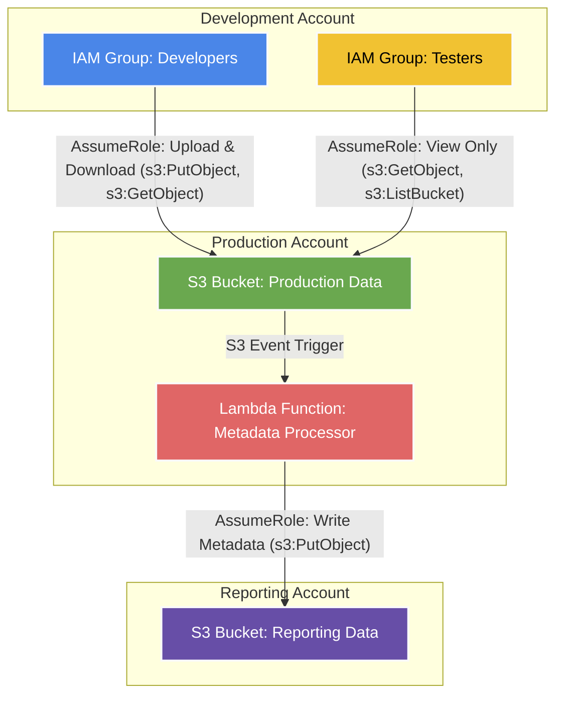

<!--more-->

### Overview

Demo a secure and common pattern for managing AWS resources across accounts. 

- ```Development``` Account: This account houses IAM groups for **Developers** and **Testers**:
  - **Developers** can assume a role that allows them to upload and download objects.
  - **Testers** can assume a more restrictive role that only allows them to view and list objects.

- ```Production``` Account: 
  - This account hosts the primary **S3** bucket🪣 with the core application data. 
  - It also hosts a **Lambda** function that acts as an automated processor. This function is triggered by S3 events (like s3:ObjectCreated:*), ensuring that actions are taken in real-time as data changes.

- ```Reporting``` Account: This account is used for storing metadata and logs. 
  - It hosts a reporting **S3** bucket🪣 storing metadata for each object on the Production bucket.
  - The Lambda function from the Production account assumes a role to write data into an S3 bucket here. 



{}
Coming soon...
{}