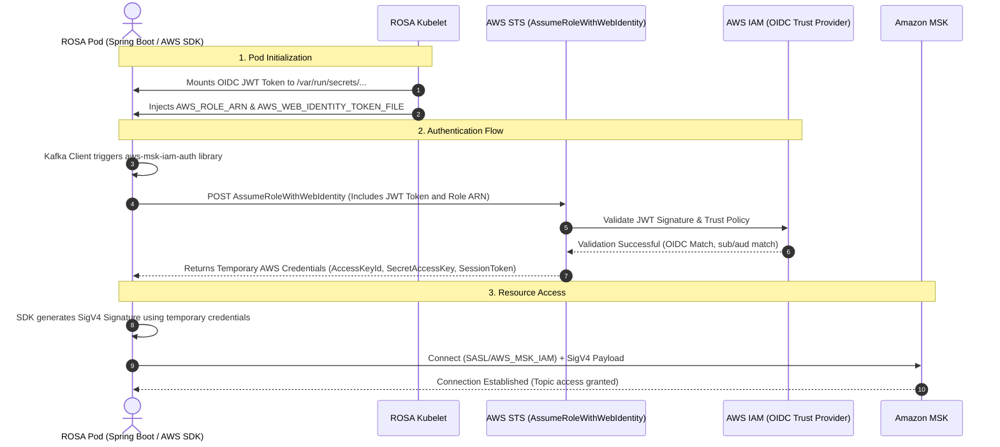

<!--more-->

### Overview

Here is the architecture and call flow illustrating how your ROSA Spring Boot application uses its ServiceAccount to authenticate with AWS MSK via AWS STS and IAM.

### IAM Roles for Service Accounts (IRSA) Call Flow

---

### Step-by-Step Breakdown

1. **Token Injection (Cluster Side):** When your pod spins up, the OpenShift mutating webhook (or EKS Pod Identity Webhook) intercepts the scheduling request. Seeing the `[eks.amazonaws.com/role-arn](https://eks.amazonaws.com/role-arn)` annotation on your ServiceAccount, it injects environment variables and mounts a projected volume containing a short-lived OpenID Connect (OIDC) JWT token into the pod.
2. **SDK Initiation:** When the Spring Boot application starts and attempts to connect to Kafka, the `aws-msk-iam-auth` library kicks in. It reads the `AWS_WEB_IDENTITY_TOKEN_FILE` and `AWS_ROLE_ARN` environment variables injected in step 1.
3. **The STS Call:** The AWS SDK makes an HTTPS `POST` request to the AWS Security Token Service (STS) endpoint, specifically calling the `AssumeRoleWithWebIdentity` API. It passes the contents of the JWT token and the ARN of the IAM Role it wants to assume.
4. **IAM Trust Evaluation:** AWS STS does not blindly trust the token. It reaches out to AWS IAM to:
* Fetch the public keys from the OIDC Provider URL (registered in AWS IAM) to verify the token's cryptographic signature.
* Verify the IAM Role's **Trust Policy** (specifically checking that the `sub` claim matches the ROSA namespace/service account and the `aud` claim matches `sts.amazonaws.com`).

5. **Credential Delivery:** Once validated, AWS STS generates short-lived, temporary AWS credentials (an Access Key, Secret Key, and Session Token) and returns them to the pod.
6. **MSK Authentication:** The `aws-msk-iam-auth` library uses these temporary credentials to sign the SASL authentication payload using AWS Signature Version 4 (SigV4). It sends this signed request to the MSK Broker.
7. **Access Granted:** MSK verifies the SigV4 signature and checks the associated IAM Role's permissions policy (e.g., `kafka-cluster:WriteData`). If permitted, the TCP connection is successfully established.

---

### Official Documentation References

To dive deeper into the specific API calls and mechanisms shown in this flow, you can reference the following official documentation:

* **AWS STS API Reference:** [AssumeRoleWithWebIdentity](https://docs.aws.amazon.com/STS/latest/APIReference/API_AssumeRoleWithWebIdentity.html) - Details the exact parameters and expected responses during the STS exchange.
* **AWS IAM Documentation:** [OIDC Federation and Web Identity](https://docs.aws.amazon.com/IAM/latest/UserGuide/id_roles_providers_create_oidc.html) - Explains how AWS IAM trusts external OIDC identity providers like ROSA.
* **Red Hat OpenShift (ROSA):** [Using IAM roles for service accounts (IRSA) with ROSA](https://www.google.com/search?q=https://docs.openshift.com/rosa/aws_integration/understanding-iam-roles-for-service-accounts.html) - Explains the cluster-side token projection and webhook injection mechanics.
* **Amazon MSK:** [IAM Access Control](https://docs.aws.amazon.com/msk/latest/developerguide/iam-access-control.html) - Details how MSK natively evaluates IAM policies attached to the roles assumed by your clients.