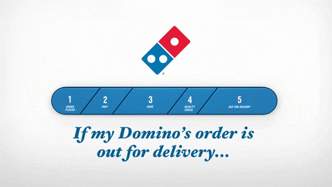

## Overview

This project turns a pizza🍕order into a small, observable event-driven workflow. A browser submits an order, AWS services pass it through kitchen stages, and status updates return to the browser in real time just like Domino's does it: 

It is a learning project, but the architecture uses patterns found in production systems - managed services, asynchronous events, small functions, and infrastructure described as code.

## Architecture

We would be using an event-driven architecture which uses events to start and communicate between decoupled services and is common in modern applications built with microservices.

We would configure an HTTP API on API Gateway to redirect requests to EventBridge. You create event bus rules that match a request and forward events to Lambda functions. Events processed by the Lambda functions are sent back to the bus as a new event. Each time an event is published to the event bus, a separate Lambda function receives the event and post it back to client application using a web socket connection hosted on an API Gateway.


## Order's Journey

An order starts as JSON:

```json
{
  "item": {
    "order_id": "7AB",
    "eventtype": "make_pizza"
  }
}
```

The browser opens a WebSocket connection with that order ID, then sends the JSON to the HTTP API. The backend advances the order through four states:

```text
make_pizza -> cook_pizza -> deliver_pizza -> delivered
```

Each transition is an event. The browser receives the matching status updates while the work continues.

## AWS Services

###### API Gateway: the entry points

The HTTP API accepts `POST/` requests and forwards their body to EventBridge. The separate WebSocket API gives the browser a persistent connection for status notifications. The WebSocket `$connect` route records the order ID before the browser submits its order.

Because the browser and API have different origins, the HTTP API also needs CORS configuration. CORS tells browsers which cross-origin requests are allowed; it is not authentication or access control for the API itself.

###### EventBridge: routing by event

EventBridge receives the initial order on a custom event bus. Rules inspect fields such as `detail.item.eventtype` and route matching events to the right Lambda function. The same status event can match more than one rule, so a stage function can advance the order while another function sends the current status to the browser.

This fan-out keeps event producers independent of every consumer. A function publishes an event; rules decide which functions should react.

###### Lambda: small steps

Three Node.js Lambda functions each handle one kitchen transition. They wait briefly so the progression is visible, update the event type, and publish the next event. Their shared `EVENT_BUS` environment variable identifies where to publish.

Two other functions handle the WebSocket lifecycle: `websocket_connect` stores the connection ID, and `receive_events` looks it up and posts status messages through the API Gateway Management API.

###### DynamoDB: connection lookup

The DynamoDB table uses `order_id` as its key and stores the associated WebSocket `connection_id`. When a status event arrives, `receive_events` looks up the connection for that order and sends the update to it. The table is a small piece of coordination state; the pizza's progress itself is carried in events.

## Infrastructure as Code

CloudFormation divides the resources into two stacks:

- `pizza-tracking-template.yml` creates the application: APIs, event bus and rules, Lambda functions, IAM roles, and the connection table.
- `webserver-template.yml` creates a public EC2 instance and installs nginx to serve the static website.

The browser assets are stored in S3 as a website archive. At startup, EC2 downloads and extracts that archive, then writes `runtime-config.js` with the API URLs supplied as stack parameters. This keeps environment-specific endpoints out of the static JavaScript bundle.

The split is useful during development: you can test the APIs and event workflow before creating the webserver. Connect a WebSocket client with an `order_id`, submit the matching order to the HTTP API, and watch for all four statuses.

## Conclusion

The project makes several cloud concepts concrete:

- **Asynchronous processing:** the HTTP request starts work without waiting for every kitchen step to finish.
- **Event routing:** EventBridge rules route based on event content rather than hard-coded calls between services.
- **Loose coupling:** producers and consumers communicate through events and can evolve independently.
- **Real-time updates:** WebSockets let the backend notify a connected browser as state changes.
- **Infrastructure as code:** CloudFormation makes the service layout reviewable and repeatable.

## TLDR`

This is a lab, not a hardened ordering platform. The APIs have no customer authentication, the webserver is reachable over HTTP, CORS allows any origin for convenience, and the connection table assumes connections remain valid. A production version would add identity and authorization, HTTPS, tighter origin rules, stale-connection handling, input validation, monitoring, and deliberate cost controls.

